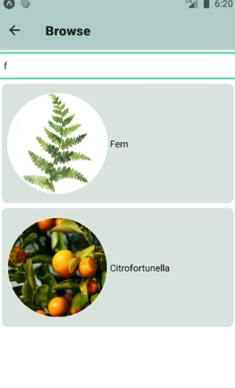
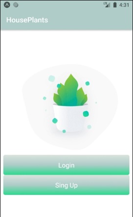
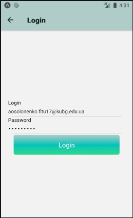
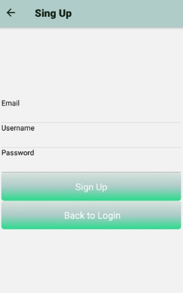

# HousePlants App
> Multi-screen mobile application for plant care.

## Table of contents
* [General info](#general-info)
* [Screenshots](#screenshots)
* [Technologies](#technologies)
* [Setup](#setup)
* [How to use the application](#Howtousetheapplication)
* [App Screens](#AppScreens)
* [Status](#status)
* [Contact](#contact)

## General info
The application is designed to help inexperienced gardeners. With the help of the application, they will be able to better understand the plants and how to care for them.

## Screenshots

## Technologies
* expo.io - SDK version 39

## How to use the application

1.  Log in to the application. To do this, click Login. Otherwise, register and click SingUp.

2.  Login or SingUP

3. Press on the field “Type a plant to search" and enter the name of the plant to search

3. Сlick on the card with the plant

____

## Setup
Follow the link and open it on your phone using qr-code.
https://snack.expo.io/@aosolonenko/houseplants
## Code Examples
Example of usage:
` return (
      <View style={styles.container}>
        <SearchInput
          onChangeText={(term) => {
            this.searchUpdated(term);
          }}
          style={styles.searchInput}
          placeholder="Type a plant to search"
        />
        <ScrollView>
          {filteredEmails.map((plant) => {
            return (
              <TouchableOpacity
                style={styles.box}
                onPress={() => {
                  this.props.navigation.navigate('Plant', {
                    name: plant.title,
                    plant: plant,
                  });
                }}>
                <Image style={styles.img} source={{ uri: plant.imgSrc }} />
                <Text style={styles.title}> {plant.title}</Text>
              </TouchableOpacity>
            );
          })}
        </ScrollView>
      </View>
    );`

## App Screens
- Welcome
- Login, SignUp
- Browse, 
- Plant, 

## Status
Project is: _in progress_, _finished_,

## Contact
Created by [@AllaSolonenko](https://www.flynerd.pl/) - feel free to contact me!
